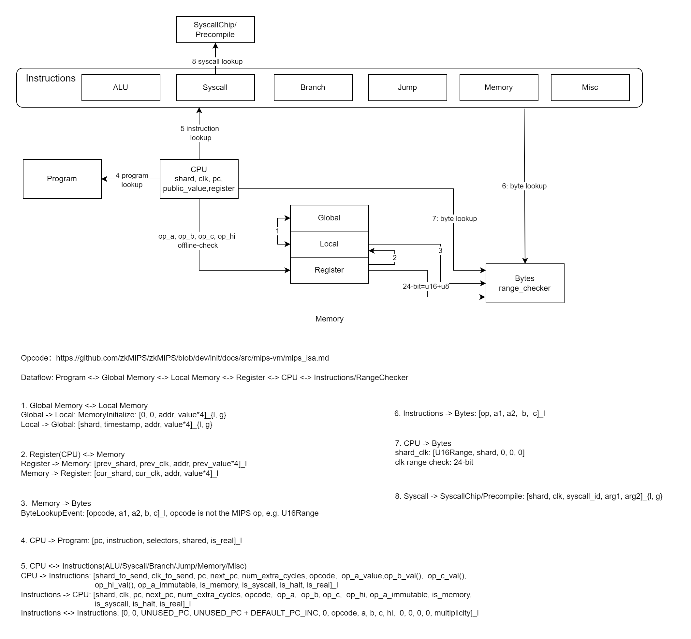

# Lookup Arguments

Lookup arguments allow generating cryptographic proofs showing that elements from a witness vector belong to a predefined table (public or private). Given:
- Table \\(T = \\{t_i\\}\\), where \\(i=0,…,N−1 \\) (public/private)
- Lookups \\(F = \\{f_j\\}\\), where \\(j=0,…,M−1 \\) (private witness)

The protocol proves  \\(F \subseteq T \\), ensuring all witness values adhere to permissible table entries. 

Since its inception, lookup protocols have evolved through continuous [optimizations](https://link.springer.com/chapter/10.1007/978-3-030-03326-2_20). Ziren implements the [​LogUp](https://eprint.iacr.org/2023/1518) protocol to enable efficient proof generation.

## LogUp

LogUp employs logarithmic derivatives for linear-complexity verification. For a randomly chosen challenge \\(\alpha\\), the relation \\(F \subseteq T\\) holds with high probability when: 
\\[ \sum_{i=0}^{M-1} \frac{1}{f_i - \alpha} = \sum_{i=0}^{N-1} \frac{m_i}{t_i - \alpha} \\]
, where \\(m_i\\) denotes the multiplicity of \\(t_i\\) in \\(F\\). See [full protocol details](https://eprint.iacr.org/2022/1530.pdf).

## LogUp Implementation in Ziren

Cross-chip verification in Ziren utilizes LogUp for consistency checks, as shown in the dependency diagram:

<!-- source: [zkMIPS-chips.drawio](https://drive.google.com/file/d/1loR3llVMTm9gw97kgsu72NEGARau1ReX/view?usp=sharing) -->

Key Lookup Relationships:

| Index | Source(F)          | Target(T)           | Verification Purpose                    |
|-------|--------------------|---------------------|-----------------------------------------|
| 1     | Global Memory      | Local Memory        | Overall memory consistency *             |
| 2     | CPU                | Memory              | Memory access patterns                  |
| 3     | Memory             | Bytes               | 8-bit range constraints                 |
| 4     | CPU                | Program             | Instruction validity                    |
| 5     | CPU                | Instructions        | Instructions operations                 |
| 6     | Instructions       | Bytes               | Operand bytes verification              |
| 7     | CPU                | Bytes               | Operand range verification              |
| 8     | Syscall            | Precompiles         | Syscall/precompiled function execution  |

<small>* In the latest implementation, Ziren employs multiset-hashing to ensure memory consistency checking, enhancing proof efficiency and modularity.</small>

## Range Check Implementation Example

**8-bit Range Check Design**

In Ziren's architecture, 32-bit values undergo byte-wise decomposition into four 8-bit components, with each byte occupying a dedicated memory column. This structural approach enables native support for 8-bit range constraints (0 ≤ value < 255) during critical operations including arithmetic logic unit (ALU) computations and memory address verification.

- Starting Lookup Table (T)

| t |
|:---:|
| 0 |
| 1 |
| ... |
| 255 |

For lookups \\(\\{f_0, f_1, \\dots, f_{M-1}\\}\\) (all elements in [0, 255]), we: 
1. Choose random \\(\alpha\\);
2. Construct two verification tables.

- Lookups (F)
  
  | f     |\\(d = 1/(f-\alpha)\\)   | sum |
  |-------|-------------------------|----------------------|
  | \\(f_0\\)   | \\(d_0=1/(f_0-\alpha)\\)| \\(d_0\\)            | 
  | \\(f_1\\)   | \\(d_1=1/(f_1-\alpha)\\)|  \\(d_0 + d_1\\)     |
  | \\(f_2\\)   | \\(d_2=1/(f_2-\alpha)\\)| \\(d_0+d_1+d_2\\)    | 
  | ...   |...                      | ...                  | 
  | \\(f_{M-1}\\)   | \\(d_m=1/(f_{M-1}-\alpha)\\)| \\(\sum_{i=0}^{M-1}d_i\\)| 
  
- Updated Lookup Table

  | t     |m             |\\(d = m/(f+\alpha)\\)              |sum                    |
  |-------|--------------|------------------------------------|-----------------------|
  | 0     | \\(m_0\\)    | \\(d_0 = m_0/\alpha \\)            | \\(d_0\\)             |
  | 1     | \\(m_1\\)    | \\(d_1 = m_1/(1-\alpha)\\)         | \\(d_0 + d_1\\)       |
  | 2     | \\(m_2\\)    | \\(d_2 = m_2/(2-\alpha)\\)         |\\(d_0+d_1+d_2\\)      |
  | ...   |...           | ...                                | ..                    |
  | 255   | \\(m_{255}\\)|\\(d_{255} = m_{255}/(255-\alpha)\\)|\\(\sum_{i=0}^{255}d_i\\)| 
,where \\(m_i\\) denotes the occurrence count of \\(i\\) in lookups.

LogUp ensures that if the final cumulative sums in both tables match (which is exactly
\\[
\sum_{i=0}^{M-1} \frac{1}{f_i - \alpha} = \sum_{i=0}^{N-1} \frac{m_i}{t_i - \alpha}
\\]
), then with high probability every \\(f_i\\) originates from table \\(T\\) (i.e., falls within 0-255 range).

