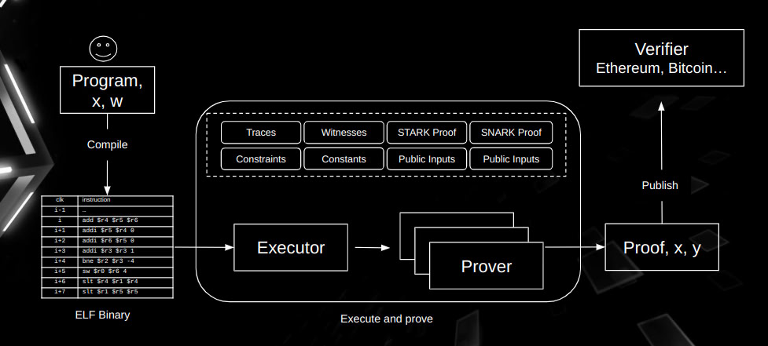

# Developer Tutorial

In essence, the "computation problem" in Ziren is the given program, and its "solution" is the **execution trace** produced when running that program.
This trace details every step of the program execution, with each row corresponding to a single step (or a cycle) and each column representing a fixed CPU variable or register state.

Proving a program means checking that every step in the trace follows the corresponding MIPS instruction, encoding the trace columns as polynomials, and committing to those polynomials with a polynomial commitment scheme.

Below is the workflow of Ziren.

## High-Level Workflow of Ziren

Referring to the above diagram, Ziren follows a structured pipeline composed of the following stages:

1. **Guest Program**
   A program written in a high-level language such as Rust, Go or C/C++, containing the application logic that needs to be proved.

2. **MIPS Compiler**
   The high-level program is compiled into a MIPS32r2 little-endian ELF binary by the Ziren toolchain.

3. **ELF Loader**
   The ELF loader reads the ELF file and prepares it for execution within the MIPS VM: it places the code and data segments at their virtual addresses, initializes memory, and sets the program's entry point.

4. **MIPS VM**
   The MIPS virtual machine runs the loaded ELF file. It records every step of execution, including register states, memory accesses and instruction addresses, as events from which the **execution trace** is generated.

5. **Execution Trace**
   The trace is the data the proof is about. Each row of a chip's table records one operation, and the constraints of every chip check that the rows follow the semantics of the MIPS instructions.

6. **Prover**
   The prover takes the execution trace and generates a zero-knowledge proof that the program ran from its entry point to a halt and produced the committed public values, without revealing private inputs.

7. **Verifier**
   Proofs can be verified natively with the `zkm-verifier` crate (also in `no_std` and WASM builds), or on EVM-compatible chains with the Solidity verifier contracts shipped with each release.

## Prover Internal Proof Generation Steps

Within the prover, Ziren processes the execution trace in several stages, ultimately producing a proof suitable for on-chain verification:

1. **Shard**
   A long execution is split into shards so that each shard's trace fits in memory. Each shard is proved independently, and the shard proofs are later joined by recursion.

2. **Chip**
   Each instruction in a shard generates one or more events, and each event is recorded in the table of a specific chip (for example `AddSub`, `LoadWord`, `Branch`, or a precompile chip such as `KeccakSponge`), each with its own set of constraints.

3. **Lookup**
   Lookups serve two purposes:
   - Cross-chip communication: a chip sends the facts it cannot check itself (for example a byte range or a memory access) to the chip that checks them.
   - Memory consistency: the value a memory read returns is the value last written to that address.

   Within a shard both are proved with the [LogUp](../design/lookup-arguments.md) argument, evaluated with the GKR protocol (LogUp-GKR). Across shards, memory is reconciled with a [multiset hash](../design/memory-checking.md) on an elliptic curve over a degree-7 extension of the KoalaBear field.

4. **Core Proof**
   The core proof is the list of shard proofs. Each shard proof commits to all of the shard's chip tables as one jagged multilinear polynomial and opens it with the WHIR polynomial commitment scheme.

5. **Compressed Proof**
   The shard proofs are aggregated into a single constant-size proof by recursion. A *normalize* (leaf) program verifies one shard proof, and *compose* programs of arity up to three merge adjacent ranges of shards until one root remains. Every recursion program's verifying key must belong to a published allowlist of keys (a Merkle tree, the "vk map"), whose root is a public value of the compressed proof.

6. **SNARK Proof**
   The compressed proof is shrunk and wrapped into a proof over the BN254 field, which is then proved with either Groth16 or PLONK, resulting in a final Groth16 or PLONK proof that can be verified on-chain.

In summary, Ziren compiles a high-level program into MIPS instructions, runs those instructions to produce an execution trace, proves the trace shard by shard with a STARK built from LogUp-GKR, a zerocheck and the jagged-over-WHIR polynomial commitment, aggregates the shard proofs by recursion, and wraps the result in a Groth16 or PLONK proof.
