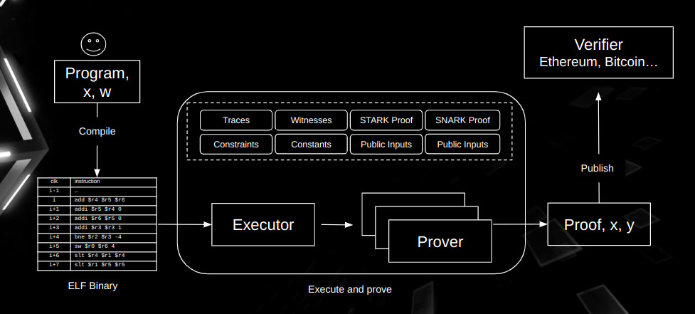

In essence, the “computation problem” in zkMIPS is the given program, and its “solution” is the **execution trace** produced when running that program. 
This trace details every step of the program execution, with each row corresponding to a single step (or a cycle) and each column representing a fixed CPU variable or register state. 

Proving a program essentially involves checking that every step in the trace aligns with the corresponding instruction and the expected logic of the MIPS program, convert the traces to polynomials and commit the polynomials by proof system.

Below is the workflow of zkMIPS.

## High-Level Workflow of zkMIPS

Referring to the above diagram, zkMIPS follows a structured pipeline composed of the following stages:

1. **Guest Program**  
   A program that written in a high-level language such as Rust, creating the application logic that needs to be proved.

2. **MIPS Compiler**  
   The high-level program is compiled into a MIPS ELF binary using a dedicated compiler. This step compiles the program into MIPS32R2 ELF binary.

3. **ELF Loader**  
   The ELF Loader reads and interprets the ELF file and prepares it for execution within the MIPS VM. This includes loading code, initializing memory, and setting up the program’s entry point.

4. **MIPS VM**  
   The MIPS Virtual Machine simulates a MIPS CPU to run the loaded ELF file. It captures every step of execution—including register states, memory accesses, and instruction addresses—and generates the **execution trace** (i.e., a detailed record of the entire computation).

5. **Execution Trace**   
   This trace is the core data structure used to verify the program. Each row represents a single step of execution, and each column corresponds to a particular CPU register or state variable. By ensuring that every step in the trace matches the intended behavior of the MIPS instructions, zkMIPS can prove the program was executed correctly.

6. **Prover**  
   The Prover takes the execution trace from the MIPS VM and generates a zero-knowledge proof. This proof shows that the program followed the correct sequence of states without revealing any sensitive internal data.  In addition, the proof is eventually used by a **Verifier Contract** or another verification component, often deployed on-chain, to confirm that the MIPS program executed as claimed.

7. **Verifier**
   Apart from the native verifier for the generated proof, zkMIPS also offers a solidity verifier for EVM-compatible blockchains.

## Prover Internal Proof Generation Steps

Within the Prover, zkMIPS employs multiple stages to efficiently process and prove the execution trace, ultimately producing a format suitable for on-chain verification:

1. **Shard**  
   To prevent memory overflow, a guest program may be split into multiple shards, allowing generation of a proof for each smaller table and then combining the proofs across tables to verify the full program execution.

2. **Chip**  
   Each instruction in a shard generates one or more events (e.g., CPU and ALU events), where each event corresponds to a specific chip (`CpuChip`, `AddSubChip`, etc.) - with its own set of constraints.

3. **Lookup**  
   Lookup serves two key purposes:
   - Cross-Chip Communication - The chip needs to send the logic which itself cannot verify to other chips for verification.
   - Consistency of memory access (the data read by the memory is the data written before) - Proving that the read and write data are “permuted”.
   Currently zkMIPS uses [multiset hashing](/design/lookup-arguments.md) to implement the Lookup argument. 

4. **Core Proof**  
   The core proof includes a set of shard proofs.

5. **Compressed Proof**  
   The core proof (a vector of shard proofs) is aggregated into a single compressed proof via the FRI recursive folding algorithm.

6. **SNARK Proof**  
   The compressed proof is further processed using either the Plonk or Groth16 algorithm, resulting in a final Plonk proof or Groth16 proof.

In conclusion, throughout this process, zkMIPS seamlessly transforms a high-level program into MIPS instructions, runs those instructions to produce an execution trace, and then applies STARK, LogUp, PLONK, and Groth16 techniques to generate a succinct zero-knowledge proof. This proof can be verified on-chain to ensure both the correctness and the privacy of the computation.
