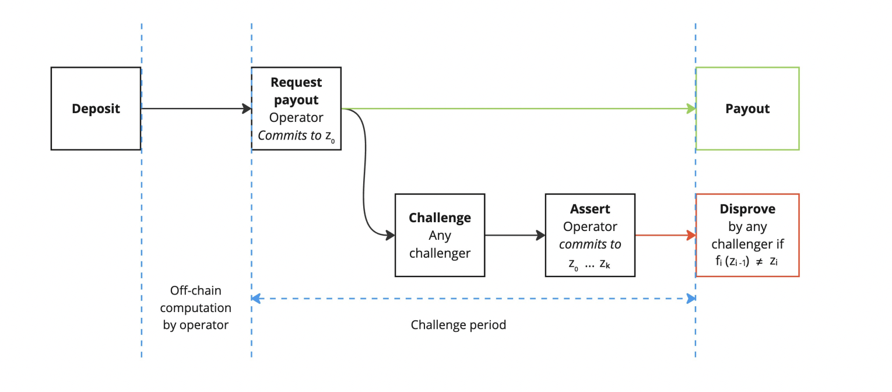

# Verifier

## Proof Verification Overview

A verifier checks a proof against:

- the program's verifying key (or its 32-byte hash);
- the public values the program committed;
- the proof itself.

Both the proving key and the verifying key are derived from the compiled guest ELF by `setup`. The 32-byte verifying key hash identifies the program: a proof verifies only under the key of the program that produced it, and any change to the guest ELF changes the key. Retrieve the hash with the SDK:

```rust
use zkm_sdk::{HashableKey, ProverClient};

let client = ProverClient::new();
let (_pk, vk) = client.setup(ELF);
let vkey_hash = vk.bytes32(); // 0x-prefixed hex string of the 32-byte program vk hash
```

Within a host, `client.verify(&proof, &vk)` verifies any proof kind. The rest of this page covers verification outside the SDK: on-chain, with the `zkm-verifier` crate, in WASM, inside the zkVM, and in BitVM.

## On-chain verification

A verifier smart contract lets anyone check a proof on an EVM chain. The proof is generated off-chain; the chain only pays for verification, whose cost does not depend on the size of the proved computation.

STARK proofs are too large to verify economically on Ethereum, so Ziren wraps them into Groth16 or PLONK proofs over BN254. A Groth16 proof is 260 bytes and a PLONK proof about 868 bytes, and both are checked with a constant number of BN254 precompile calls. Every on-chain proof has three public inputs:

1. the program verifying key hash (`vk.bytes32()`);
2. the digest of the public values: SHA-256 of the committed bytes, masked to 253 bits so it fits in a BN254 field element;
3. the root of the recursion verifying key allowlist (the "vk map") of the Ziren release that produced the proof.

### Verifier Contracts

The verifier contracts of each release are generated when the circuit is built, from the templates in [`crates/recursion/gnark-ffi/assets`](https://github.com/ProjectZKM/Ziren/tree/main/crates/recursion/gnark-ffi/assets), and are shipped in the release's circuit artifacts. After the SDK has installed the artifacts (see [Prover](./prover.md)), they are in:

- `~/.zkm/circuits/groth16/<version>/`: `ZKMVerifierGroth16.sol` and `Groth16Verifier.sol`;
- `~/.zkm/circuits/plonk/<version>/`: `ZKMVerifierPlonk.sol` and `PlonkVerifier.sol`.

The contracts are:

- **IZKMVerifier** is the verifier interface.
- **ZKMVerifierGroth16.sol** and **ZKMVerifierPlonk.sol** (both define a contract named `ZKMVerifier`) check the verifier selector, compute the public inputs, and call the proof system verifier.
- **Groth16Verifier.sol** and **PlonkVerifier.sol** implement the pairing checks of the proof systems; they are generated by gnark from the circuit's verifying key.

`IZKMVerifier.sol`:

```solidity
// SPDX-License-Identifier: MIT
pragma solidity ^0.8.20;

/// @title Ziren Verifier Interface
/// @author ZKM Labs
/// @notice This contract is the interface for the Ziren Verifier.
interface IZKMVerifier {
    /// @notice Verifies a proof with given public values and vkey.
    /// @dev It is expected that the first 4 bytes of proofBytes must match the first 4 bytes of
    /// target verifier's VERIFIER_HASH.
    /// @param programVKey The verification key for the MIPS program.
    /// @param publicValues The public values encoded as bytes.
    /// @param proofBytes The proof of the program execution the Ziren zkVM encoded as bytes.
    function verifyProof(
        bytes32 programVKey,
        bytes calldata publicValues,
        bytes calldata proofBytes
    ) external view;
}

interface IZKMVerifierWithHash is IZKMVerifier {
    /// @notice Returns the hash of the verifier.
    function VERIFIER_HASH() external pure returns (bytes32);
}
```

`verifyProof` takes the program verifying key hash, the public values and the proof. `VERIFIER_HASH` is the SHA-256 hash of the Groth16 or PLONK verifying key; the first 4 bytes of every proof (as returned by `proof.bytes()`) must equal its first 4 bytes. The check rejects a proof sent to the wrong verifier, for example a PLONK proof sent to the Groth16 verifier or a proof from another release.

The Groth16 template, `ZKMVerifierGroth16.txt`, from which each release's `ZKMVerifierGroth16.sol` is generated:

```solidity
// SPDX-License-Identifier: MIT
pragma solidity ^0.8.20;

import {IZKMVerifier, IZKMVerifierWithHash} from "../IZKMVerifier.sol";
import {Groth16Verifier} from "./Groth16Verifier.sol";

/// @title Ziren Verifier
/// @author ZKM Labs
/// @notice This contracts implements a solidity verifier for Ziren.
contract ZKMVerifier is Groth16Verifier, IZKMVerifierWithHash {
    /// @notice Thrown when the verifier selector from this proof does not match the one in this
    /// verifier. This indicates that this proof was sent to the wrong verifier.
    /// @param received The verifier selector from the first 4 bytes of the proof.
    /// @param expected The verifier selector from the first 4 bytes of the VERIFIER_HASH().
    error WrongVerifierSelector(bytes4 received, bytes4 expected);

    /// @notice Thrown when the proof is invalid.
    error InvalidProof();

    function VERSION() external pure returns (string memory) {
        return "{ZKM_CIRCUIT_VERSION}";
    }

    /// @inheritdoc IZKMVerifierWithHash
    function VERIFIER_HASH() public pure returns (bytes32) {
        return {VERIFIER_HASH};
    }

    /// @notice The root of the Merkle tree of recursion verifying keys this verifier accepts.
    /// @dev Inside the proof tree this root is a witness the prover supplies, so the in-circuit
    /// checks only establish that every child key lies in a tree with *that* root. Supplying this
    /// value as a public input here, rather than taking it from the caller, is what binds a proof
    /// to the published recursion programs and rules out one built around a substituted compose,
    /// leaf or shrink program.
    function VK_ROOT() public pure returns (bytes32) {
        return {VK_ROOT};
    }

    /// @notice Hashes the public values to a field elements inside Bn254.
    /// @param publicValues The public values.
    function hashPublicValues(
        bytes calldata publicValues
    ) public pure returns (bytes32) {
        return sha256(publicValues) & bytes32(uint256((1 << 253) - 1));
    }

    /// @notice Verifies a proof with given public values and vkey.
    /// @param programVKey The verification key for the MIPS program.
    /// @param publicValues The public values encoded as bytes.
    /// @param proofBytes The proof of the program execution the Ziren zkVM encoded as bytes.
    function verifyProof(
        bytes32 programVKey,
        bytes calldata publicValues,
        bytes calldata proofBytes
    ) external view {
        bytes4 receivedSelector = bytes4(proofBytes[:4]);
        bytes4 expectedSelector = bytes4(VERIFIER_HASH());
        if (receivedSelector != expectedSelector) {
            revert WrongVerifierSelector(receivedSelector, expectedSelector);
        }

        bytes32 publicValuesDigest = hashPublicValues(publicValues);
        uint256[3] memory inputs;
        inputs[0] = uint256(programVKey);
        inputs[1] = uint256(publicValuesDigest);
        inputs[2] = uint256(VK_ROOT());
        uint256[8] memory proof = abi.decode(proofBytes[4:], (uint256[8]));
        this.Verify(proof, inputs);
    }
}
```

The release build fills in `{ZKM_CIRCUIT_VERSION}` (for example `v2.0.0`), `{VERIFIER_HASH}` and `{VK_ROOT}`. The contract:

- checks that the first 4 bytes of `proofBytes` match `VERIFIER_HASH`;
- binds the proof to the program through `programVKey`;
- binds it to the public values through their SHA-256 digest;
- binds it to the release's recursion programs through `VK_ROOT`, which is a constant of the contract and not an argument, so a caller cannot substitute another allowlist;
- calls `Groth16Verifier.Verify`, which reverts if the proof is invalid.

The PLONK contract is the same except for the last step: it passes the three inputs as a `uint256[]` together with the raw proof bytes to `PlonkVerifier.Verify`, and reverts with `InvalidProof()` when that returns `false`.

A proof verifies only against the contracts of the release that produced it: a different release has a different `VERIFIER_HASH` or `VK_ROOT`.

### Application Contracts

An application contract stores the program verifying key hash and calls a deployed `ZKMVerifier` through the interface. The following contract accepts proofs of a Fibonacci guest that commits its outputs ABI-encoded as `(uint32 n, uint32 a, uint32 b)` (for example with `alloy_sol_types::SolType::abi_encode`):

```solidity
// SPDX-License-Identifier: MIT
pragma solidity ^0.8.20;

import {IZKMVerifier} from "./IZKMVerifier.sol";

struct PublicValuesStruct {
    uint32 n;
    uint32 a;
    uint32 b;
}

contract Fibonacci {
    /// @notice The address of the Ziren verifier contract.
    IZKMVerifier public verifier;

    /// @notice The verification key hash for the fibonacci program.
    bytes32 public fibonacciProgramVKey;

    constructor(IZKMVerifier _verifier, bytes32 _fibonacciProgramVKey) {
        verifier = _verifier;
        fibonacciProgramVKey = _fibonacciProgramVKey;
    }

    function verifyFibonacciProof(bytes calldata _publicValues, bytes calldata _proofBytes)
        public
        view
        returns (uint32, uint32, uint32)
    {
        verifier.verifyProof(fibonacciProgramVKey, _publicValues, _proofBytes);
        PublicValuesStruct memory publicValues = abi.decode(_publicValues, (PublicValuesStruct));
        return (publicValues.n, publicValues.a, publicValues.b);
    }
}
```

The arguments come from the host (see [`examples/fibonacci/host/bin/groth16_bn254.rs`](https://github.com/ProjectZKM/Ziren/blob/main/examples/fibonacci/host/bin/groth16_bn254.rs)):

- `_fibonacciProgramVKey` is `vk.bytes32()`;
- `_publicValues` is `proof.public_values.as_slice()`;
- `_proofBytes` is `proof.bytes()`.

### Deployment

The contracts are plain Solidity and can be deployed with any tool. With Foundry, place `IZKMVerifier.sol` in `src/` and the release's two Groth16 contracts in `src/<version>/` (the layout their imports expect), and deploy the verifier with a script:

```solidity
// SPDX-License-Identifier: UNLICENSED
pragma solidity ^0.8.20;

import {Script} from "forge-std/Script.sol";
import {ZKMVerifier} from "../src/v2.0.0/ZKMVerifierGroth16.sol";

contract ZKMVerifierGroth16Script is Script {
    function run() public {
        vm.startBroadcast();
        new ZKMVerifier();
        vm.stopBroadcast();
    }
}
```

```bash
forge script script/ZKMVerifierGroth16.s.sol:ZKMVerifierGroth16Script \
  --rpc-url $RPC_URL --private-key $PK --broadcast
```

Then deploy the application contract with the verifier's address and the program verifying key hash. Anyone can then call `verifyProof` (directly or through the application contract) with a proof; the call reverts if the proof is invalid.

## Off-chain verification

Off-chain verification checks compressed STARK, Groth16 and PLONK proofs without a chain, and so without gas. Compressed proofs can be verified directly, without the STARK-to-SNARK wrapping. The result is only known to whoever runs the check.

### **The `zkm-verifier` Crate**

The [`zkm-verifier`](https://github.com/ProjectZKM/Ziren/tree/main/crates/verifier) crate verifies proofs without the prover. It supports `no_std` (disable the default `std` feature), so it also builds for WASM and for the zkVM itself. It embeds the verifying keys of its Ziren release:

- `GROTH16_VK_BYTES` and `PLONK_VK_BYTES`: the Groth16 and PLONK verifying keys;
- `VK_ROOT_BYTES`: the recursion verifying key allowlist root, the third public input;
- `IMM_GROTH16_VK_BYTES` and `PART_STARK_VK_BYTES`: the keys for the immutable-wrap-vk mode.

Its verifiers take the byte encodings the SDK produces (`proof.bytes()`, `proof.public_values.to_vec()`, `vk.bytes32()`):

| Function | Verifies |
|---|---|
| `Groth16Verifier::verify(proof, public_values, vkey_hash, groth16_vk)` | a Groth16 proof |
| `Groth16Verifier::verify_by_imm_groth16_vk(proof, public_values, vkey_hash, imm_groth16_vk, part_stark_vk)` | a Groth16 proof made in the immutable-wrap-vk mode; `Groth16Verifier::get_part_stark_vk(version)` returns a bundled release's partial STARK key |
| `PlonkVerifier::verify(proof, public_values, vkey_hash, plonk_vk)` | a PLONK proof |
| `StarkVerifier::verify(proof, public_values, vk)` | a compressed proof (`proof.bytes()`) against the bincode-serialized `ZKMVerifyingKey`, and checks that the public values match the digest committed in the proof |
| `StarkVerifier::verify_proof(proof, vk)` | a compressed proof, without the public values check |

For example:

```rust
use zkm_verifier::{Groth16Verifier, GROTH16_VK_BYTES};

Groth16Verifier::verify(&proof_bytes, &public_values, &vkey_hash, *GROTH16_VK_BYTES)
    .expect("invalid proof");
```

With the `ark` feature, the crate also converts proofs to [arkworks](https://github.com/arkworks-rs) types and verifies them with `ark-groth16`.

### **WASM Verification**

Ziren provides WASM bindings for verifying Groth16, PLONK, and STARK proofs in-browser. These bindings are generated from Rust functions in the `zkm_verifier` crate and exposed to JavaScript via `wasm_bindgen`. See the [ziren-wasm-verifier](https://github.com/ProjectZKM/ziren-wasm-verifier) repository for setup instructions.

The repository includes the following: 

- The **guest program** (with an example on computing the Fibonacci sequence) takes an input `n`, commits it to the public values, computes the sequence, and writes outputs (`a`, `b`) to public values via zkVM syscalls.
- The **host program** compiles the guest to an ELF using `zkm_build`, runs setup with `ProverClient`, generates the proof, and saves the proof, public values, and verifying key hash.
- The **verifier directory** wraps the Rust verifier functions with `wasm_bindgen` so they can be invoked from JavaScript after running `wasm-pack build`.

The following is an example verifier wrapper (`verifier/lib.rs`):

```rust
//! A simple wrapper around the `zkm_verifier` crate.

use wasm_bindgen::prelude::wasm_bindgen;
use zkm_verifier::{
    Groth16Verifier, PlonkVerifier, StarkVerifier, GROTH16_VK_BYTES, PLONK_VK_BYTES,
};

/// Wrapper around [`zkm_verifier::StarkVerifier::verify`].
#[wasm_bindgen]
pub fn verify_stark(proof: &[u8], public_inputs: &[u8], zkm_vk: &[u8]) -> bool {
    StarkVerifier::verify(proof, public_inputs, zkm_vk).is_ok()
}

/// Wrapper around [`zkm_verifier::Groth16Verifier::verify`].
///
/// We hardcode the Groth16 VK bytes to only verify Ziren proofs.
#[wasm_bindgen]
pub fn verify_groth16(proof: &[u8], public_inputs: &[u8], zkm_vk_hash: &str) -> bool {
    Groth16Verifier::verify(proof, public_inputs, zkm_vk_hash, *GROTH16_VK_BYTES).is_ok()
}

/// Wrapper around [`zkm_verifier::PlonkVerifier::verify`].
///
/// We hardcode the Plonk VK bytes to only verify Ziren proofs.
#[wasm_bindgen]
pub fn verify_plonk(proof: &[u8], public_inputs: &[u8], zkm_vk_hash: &str) -> bool {
    PlonkVerifier::verify(proof, public_inputs, zkm_vk_hash, *PLONK_VK_BYTES).is_ok()
}

```

All Rust functions in the `zkm_verifier` crate encoding the verification logic for the proof systems are wrapped to generate WASM bindings. 

The repository also contains a few examples. The `wasm_example` script demonstrates verifying proofs in Node.js: 

```javascript
/**
 * This script verifies the proofs generated by the script in `example/host`.
 *
 * It loads json files in `example/json` and verifies them using the wasm bindings
 * in `example/verifier/pkg/zkm_wasm_verifier.js`.
 */

import * as wasm from "../../verifier/pkg/zkm_wasm_verifier.js"
import fs from 'node:fs'
import path from 'node:path'

// Convert a hexadecimal string to a Uint8Array
export const fromHexString = (hexString) =>
    Uint8Array.from(hexString.match(/.{1,2}/g).map((byte) => parseInt(byte, 16)));

const files = fs.readdirSync("../json");

// Iterate through each file in the data directory
for (const file of files) {
    try {
        // Read and parse the JSON content of the file
        const fileContent = fs.readFileSync(path.join("../json", file), 'utf8');
        const proof_json = JSON.parse(fileContent);

        // Determine the ZKP type (Groth16 or Plonk) based on the filename
        const file_name = file.toLowerCase();
        const zkpType = file_name.includes('groth16') ? 'groth16' : file_name.includes('plonk')? 'plonk' : 'stark';
        const proof = fromHexString(proof_json.proof);
        const public_inputs = fromHexString(proof_json.public_inputs);
        const vkey_hash = proof_json.vkey_hash;

        // Get the values using DataView.
        const view = new DataView(public_inputs.buffer);

        // Read each 32-bit (4 byte) integer as little-endian
        const n = view.getUint32(0, true);
        const a = view.getUint32(4, true);
        const b = view.getUint32(8, true);

        console.log(`n: ${n}`);
        console.log(`a: ${a}`);
        console.log(`b: ${b}`);

        if (zkpType == 'stark') {
            const vkey = fromHexString(proof_json.vkey);

            const startTime = performance.now();
            const result = wasm.verify_stark(proof, public_inputs, vkey);
            const endTime = performance.now();
            console.log(`${zkpType} verification took ${endTime - startTime}ms`);
            console.assert(result, "result:", result, "proof should be valid");
            console.log(`Proof in ${file} is valid.`);
        } else {
            // Select the appropriate verification function and verification key based on ZKP type
            const verifyFunction = zkpType === 'groth16' ? wasm.verify_groth16 : wasm.verify_plonk;

            const startTime = performance.now();
            const result = verifyFunction(proof, public_inputs, vkey_hash);
            const endTime = performance.now();
            console.log(`${zkpType} verification took ${endTime - startTime}ms`);
            console.assert(result, "result:", result, "proof should be valid");
            console.log(`Proof in ${file} is valid.`);
        }
    } catch (error) {
        console.error(`Error processing ${file}: ${error.message}`);
    }
}
```

The following logic is included in the script: 

- Loads proof JSON files from `example/json/`.
- Decodes hex-encoded proof and public inputs.
- Dispatches verification to the appropriate WASM binding (`verify_stark`, `verify_groth16`, or `verify_plonk`).

STARK verification requires converting the verifying key to bytes and passing it explicitly, while Groth16 and PLONK require the `vkey_hash`.

This example logs:

- Input values (n, a, b)
- Verification time (in ms)
- Whether the proof is valid

The `eth_wasm` example demonstrates **in-browser STARK verification for Ethereum block proofs** for [EthProofs](https://ethproofs.org/).

main.js: 

```javascript
/**
 * This script verifies the proofs generated by the script in `example/host`.
 *
 * It loads json files in `example/json` and verifies them using the wasm bindings
 * in `example/verifier/pkg/zkm_wasm_verifier.js`.
 */

import * as wasm from "../../verifier/pkg/zkm_wasm_verifier.js"
import fs from 'node:fs'

const vkey = fs.readFileSync('../binaries/eth_vk.bin');

// Download the proof from https://ethproofs.org/blocks/23174100 > ZKM
const proof = fs.readFileSync('../binaries/23174100_ZKM_167157.txt');

const startTime = performance.now();
const result = wasm.verify_stark_proof(proof, vkey);
const endTime = performance.now();

console.log(`stark verification took ${endTime - startTime}ms`);
console.assert(result, "result:", result, "proof should be valid");
console.log(`ETH proof is valid.`);
```

The script reads a STARK verifying key and an Ethereum block proof downloaded from [EthProofs](https://ethproofs.org/), and calls `verify_stark_proof`, which wraps `StarkVerifier::verify_proof`. Unlike `verify_stark`, it takes no separate public values: it checks the proof against the verifying key only, and the block's public values are read from the proof. The proof and the verifying key must come from the same Ziren release as the verifier.

The EthProofs project uses a modified version of the WASM verifier, published as an npm package: [@ethproofs/ziren-wasm-stark-verifier](https://www.npmjs.com/package/@ethproofs/ziren-wasm-stark-verifier).

For the Fibonacci example with `n = 1000`, the script prints `n: 1000`, `a: 5965` and `b: 3651`, the verification time, and whether each proof is valid.

The WASM verifier embeds the verifying keys of one Ziren release, so it verifies only proofs of that release.

### **no_std Verification**

Because `zkm-verifier` is `no_std`, it can run where the Rust standard library is unavailable:

1. in resource-constrained or bare-metal environments;
2. inside the zkVM, as a guest program.

A verifier guest reads a proof, its public values and the program verifying key hash from the input stream and verifies the proof. Proving that guest yields a proof of verification. The [groth16 example](https://github.com/ProjectZKM/Ziren/tree/main/examples/groth16) executes such a guest on a Groth16 proof of the Fibonacci program.

The host generates the Fibonacci proof and executes the verifier guest on it:

```rust
//! A script that generates a Groth16 proof for the Fibonacci program, and verifies the
//! Groth16 proof in ZKM.

use zkm_sdk::{include_elf, utils, HashableKey, ProverClient, ZKMStdin};

/// The ELF for the Groth16 verifier program.
const GROTH16_ELF: &[u8] = include_elf!("groth16-verifier");

/// The ELF for the Fibonacci program.
const FIBONACCI_ELF: &[u8] = include_elf!("fibonacci");

/// Generates the proof, public values, and vkey hash for the Fibonacci program in a format that
/// can be read by `zkm-verifier`.
///
/// Returns the proof bytes, public values, and vkey hash.
fn generate_fibonacci_proof() -> (Vec<u8>, Vec<u8>, String) {
    let n = 20u32;

    let mut stdin = ZKMStdin::new();
    stdin.write(&n);

    let client = ProverClient::new();

    let (pk, vk) = client.setup(FIBONACCI_ELF);
    println!("vk: {:?}", vk.bytes32());
    let proof = client.prove(&pk, stdin).groth16().run().unwrap();
    (proof.bytes().expect("the proof has a byte encoding"), proof.public_values.to_vec(), vk.bytes32())
}

fn main() {
    utils::setup_logger();

    let (fibonacci_proof, fibonacci_public_values, vk) = generate_fibonacci_proof();

    let mut stdin = ZKMStdin::new();
    stdin.write_vec(fibonacci_proof);
    stdin.write_vec(fibonacci_public_values);
    stdin.write(&vk);

    let client = ProverClient::new();

    let (_, report) = client.execute(GROTH16_ELF, &stdin).run().unwrap();
    println!("executed groth16 program with {} cycles", report.total_instruction_count());
    println!("{}", report);
}
```

The verifier guest:

```rust
//! A program that verifies a Groth16 proof in ZKM.

#![no_main]
zkm_zkvm::entrypoint!(main);

use zkm_verifier::Groth16Verifier;

pub fn main() {
    let proof = zkm_zkvm::io::read_vec();
    let zkm_public_values = zkm_zkvm::io::read_vec();
    let zkm_vkey_hash: String = zkm_zkvm::io::read();

    let groth16_vk = *zkm_verifier::GROTH16_VK_BYTES;
    println!("cycle-tracker-start: verify");
    let result = Groth16Verifier::verify(&proof, &zkm_public_values, &zkm_vkey_hash, groth16_vk);
    println!("cycle-tracker-end: verify");

    match result {
        Ok(()) => {
            println!("Proof is valid");
        }
        Err(e) => {
            println!("Error verifying proof: {:?}", e);
        }
    }
}
```

`Groth16Verifier::verify` checks that the proof's selector matches the Groth16 verifying key, then verifies the proof against the three public inputs: the program verifying key hash, the digest of the public values, and `VK_ROOT_BYTES`.

## BitVM Verifier

BitVM-based verification combines both off-chain and on-chain steps depending on the phase of the process. Ziren integrates with GOAT Network’s BitVM2 node to support verification in a Bitcoin-native environment, which allows ZK proofs to ultimately inherit Bitcoin’s security guarantees.

Ziren generates a proof for each L2 block, which is then ingested and stored by the BitVM2 node. These individual block proofs are recursively aggregated, and can be wrapped (for example into Groth16 format) to support other verification environments. BitVM2 implements an optimistic fraud-proof mechanism. In the default case, proofs are accepted based on off-chain checks and periodic sequencer commitments. If, however, an invalid proof is suspected, honest validators can trigger a challenge protocol. This protocol reduces the entire computation trace to a single disputed step, which is then resolved directly on Bitcoin L1. By doing so, the protocol ensures that verified proofs settled through BitVM2 achieve security equivalent to Bitcoin consensus while enabling efficient ZK-based verification.

Proofs are verified off-chain for peg-ins, peg-outs and sequencer commitments. During a peg-in, an SPV proof is generated proving that the user’s transaction of their deposit was included in a valid block. The GOAT contract and committee verify this proof off-chain. During a peg-out, Ziren generates a ZK proof that attests to the correctness of the PegBTC burn and the L2 state. This proof is initially checked off-chain by watchers, the committee, and potential challengers.

 If no dispute is raised, the operator is reimbursed without requiring any further on-chain action. If a dispute is raised, the on-chain challenge process begins. The Watchtower generates the longest chain proof and verifies that the operator’s Kickoff commitment matches the canonical longest chain. If this chain-level check passes, challengers can proceed to the circuit-level dispute. At that stage, the entire execution trace is revealed and challenge protocol narrows the disagreement down to the disputed computation. The Bitcoin covenant then executes the check on-chain to verify if the step belongs to the committed state and if the state transition  is either valid or invalid. As a result, direct costs are only incurred during disputes.

In addition to bridging operations, the BitVM2 protocol also requires sequencer set commitments. Periodically, the committee commits the sequencer set (sequencer public keys) to Bitcoin L1. Merkle proofs of individual sequencers can then be verified off-chain against this root, ensuring that the sequencers producing L2 blocks are consistent with the commitments.

Overall, this design makes it so that proofs are not posted to Bitcoin for every block. Although proofs are generated per block, they are stored and aggregated off-chain, and verification by default also takes place off-chain. The Bitcoin L1 is only involved in periodic sequencer commitments and in disputes, where a single step is checked on-chain. 

Note that in the EVM verification based setting, every proof must be submitted and verified on-chain, with each verification incurring a gas cost. Verification is also immediate and canonical in Ethereum state. By contrast, BitVM2 verification avoids per-proof L1 costs, only escalating to Bitcoin L1 in the presence of fraud dispute, while still anchoring security in Bitcoin consensus.



BitVM transaction flow. See the full paper [here](https://bitvm.org/bitvm_bridge.pdf).

