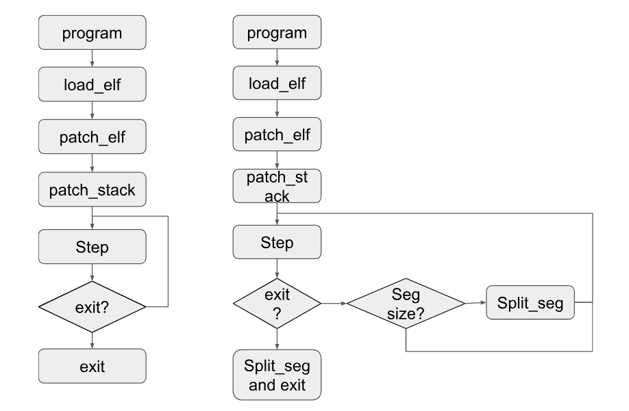
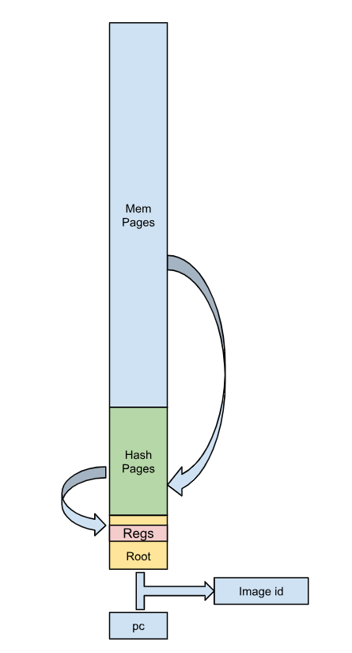

# Emulator

The emulator mainly implements the simulation operation of MIPS instruction set and provides interfaces to run MIPS ELF program and generate segments. All the code can be found in [zkm/emulator](https://github.com/zkMIPS/zkm/tree/main/emulator)

## Execution process

The execution process of MIPS program is as follows: (The left is common execution process, The right is process of execution with segments splitting)



The main steps are as follows:

- load_elf: Load mips programs into simulated memory.
- patch_elf: Hide some ignorable processes (such as some checks in runtime).
- patch_stack: Initialize the initial runtime stack (including filling program parameters into the stack).
- step: Execute an instruction. In the common execution process, directly determine whether the execution exit condition is triggered after the step. If triggered, enter the exit process, otherwise continue to execute the next step; if it is a segments-splitting execution process, after checking the exit condition Also check whether the number of currently executed steps reaches the segment threshold. If it does, enter the split_seg process. If the exit condition is triggered, enter the split_seg + exit process.
- split_seg: Generate the pre-memory-image of the current segment (including the system architecture state) and the pre/post image_id, and use this information to generate the segment data structure and write it to the corresponding segment output file.
- Exit: End program execution.

## Main data structure

The main data structures used include: 

- InstrumentedState:  Maintain the overall information of simulation system, includes the MIPS architecture state, current segment id, pre-state of current segment, such as pc, image id, hash root,  input, .etc.

  ```
  pub struct InstrumentedState {
     /// state stores the state of the MIPS emulator
     pub state: Box<State>,
  
  
     /// writer for stdout
     stdout_writer: Box<dyn Write>,
     /// writer for stderr
     stderr_writer: Box<dyn Write>,
  
  
     pub pre_segment_id: u32,
     pre_pc: u32,
     pre_image_id: [u8; 32],
     pre_hash_root: [u8; 32],
     block_path: String,
     pre_input: Vec<Vec<u8>>,
     pre_input_ptr: usize,
     pre_public_values: Vec<u8>,
     pre_public_values_ptr: usize,
  }
  ```

  

- State:  Maintain the MiPS architecture state(register, memory, heap pointer, .etc. ) of simulation system.

  ```
  pub struct State {
     pub memory: Box<Memory>,
  
  
     /// the 32 general purpose registers of MIPS.
     pub registers: [u32; 32],
     /// the pc register stores the current execution instruction address.
     pub pc: u32,
     /// the next pc stores the next execution instruction address.
     next_pc: u32,
     /// the hi register stores the multiplier/divider result high(remainder) part.
     hi: u32,
     /// the low register stores the multiplier/divider result low(quotient) part.
     lo: u32,
  
  
     /// heap handles the mmap syscall.
     heap: u32,
  
  
     /// brk handles the brk syscall
     brk: u32,
  
  
     /// tlb addr
     local_user: u32,
  
  
     /// step tracks the total step has been executed.
     pub step: u64,
     pub total_step: u64,
  
  
     /// cycle tracks the total cycle has been executed.
     pub cycle: u64,
     pub total_cycle: u64,
  
  
     /// A stream of input values (global to the entire program).
     pub input_stream: Vec<Vec<u8>>,
  
  
     /// A ptr to the current position in the input stream incremented by HINT_READ opcode.
     pub input_stream_ptr: usize,
  
  
     /// A stream of public values from the program (global to entire program).
     pub public_values_stream: Vec<u8>,
  
  
     /// A ptr to the current position in the public values stream, incremented when reading from public_values_stream.
     pub public_values_stream_ptr: usize,
  
  
     pub exited: bool,
     pub exit_code: u8,
     dump_info: bool,
  }
  ```

  

- Memory: Maintain the current memory image of the system and the access trace information of the current segment.

  ```
  pub struct Memory {
     /// page index -> cached page
     pages: BTreeMap<u32, Rc<RefCell<CachedPage>>>,
  
  
     // two caches: we often read instructions from one page, and do memory things with another page.
     // this prevents map lookups each instruction
     last_page_keys: [Option<u32>; 2],
     last_page: [Option<Rc<RefCell<CachedPage>>>; 2],
  
  
     // for implement std::io::Read trait
     addr: u32,
     count: u32,
  
  
     rtrace: BTreeMap<u32, [u8; PAGE_SIZE]>,
     wtrace: [BTreeMap<u32, Rc<RefCell<CachedPage>>>; 3],
  }
  
  ```

- Segment: Maintain the segment related information.

  ```
  pub struct Segment {
     pub mem_image: BTreeMap<u32, u32>,  // initial memory image of segment
     pub pc: u32,                        // initial pc
     pub segment_id: u32,                // segment id
     pub pre_image_id: [u8; 32],         // image id of segment pre state 
     pub pre_hash_root: [u8; 32],       // hash root of segment pre memory image      
     pub image_id: [u8; 32],            // image id of segment post state 
     pub page_hash_root: [u8; 32],      // hash root of segment post memory image
     pub end_pc: u32,                   // end pc
     pub step: u64,                     // step number of cur segment
     pub input_stream: Vec<Vec<u8>>,
     pub input_stream_ptr: usize,
     pub public_values_stream: Vec<u8>,
     pub public_values_stream_ptr: usize,
  }
  
  ```


## Instruction simulation

The emulator uses the instruction parsing method to execute instructions: first fetch the instruction, then parse and execute the corresponding function according to the instruction encoding, and update the system State/Memory status.
The main code: mips_step() can be found in [state.rs](https://github.com/zkMIPS/zkm/blob/main/emulator/src/state.rs).

### Supported instructions

The support instructions are as follows:

| instruction | Op [31:26] | rs [25:21]  | rt [20:16]  | rd [15:11]  | shamt [10:6] | func [5:0]  | function                                                     |
| ----------- | ---------- | ----------- | ----------- | ----------- | ------------ | ----------- | ------------------------------------------------------------ |
| ADD         | 000000     | rs          | rt          | rd          | 00000        | 100000      | rd = rs+rt                                                   |
| ADDI        | 001000     | rs          | rt          | imm         | imm          | imm         | rt = rs + sext(imm)                                          |
| ADDIU       | 001001     | rs          | rt          | imm         | imm          | imm         | rt = rs + sext(imm)                                          |
| ADDU        | 000000     | rs          | rt          | rd          | 00000        | 100001      | rd = rs+rt                                                   |
| AND         | 000000     | rs          | rt          | rd          | 00000        | 100100      | rd = rs&rt                                                   |
| ANDI        | 001100     | rs          | rt          | imm         | imm          | imm         | rt = rs & zext(imm)                                          |
| BEQ         | 000100     | rs          | rt          | offset      | offset       | offset      | PC = PC + sext(offset << 2)， if rs == rt                    |
| BGEZ        | 000001     | rs          | 00001       | offset      | offset       | offset      | PC = PC + sext(offset << 2)， if rs >= 0                     |
| BGTZ        | 000111     | rs          | 00000       | offset      | offset       | offset      | PC = PC + sext(offset << 2)， if rs > 0                      |
| BLEZ        | 000110     | rs          | 00000       | offset      | offset       | offset      | PC = PC + sext(offset << 2)， if rs <= 0                     |
| BLTZ        | 000001     | rs          | 00000       | offset      | offset       | offset      | PC = PC + sext(offset << 2)， if rs < 0                      |
| BNE         | 000101     | rs          | rt          | offset      | offset       | offset      | PC = PC + sext(offset << 2)， if rs != rt                    |
| CLO         | 011100     | rs          | rt          | rd          | 00000        | 100001      | rd = count_leading_ones(rs)                                  |
| CLZ         | 011100     | rs          | rt          | rd          | 00000        | 100000      | rd = count_leading_zeros(rs)                                 |
| DIV         | 000000     | rs          | rt          | 00000       | 00000        | 011010      | (hi, lo) = rs / rt                                           |
| DIVU        | 000000     | rs          | rt          | 00000       | 00000        | 011011      | (hi, lo) = rs / rt                                           |
| J           | 000010     | instr_index | instr_index | instr_index | instr_index  | instr_index | PC = PC[GPRLEN-1..28] \|\| instr_index \|\| 0 0              |
| JAL         | 000011     | instr_index | instr_index | instr_index | instr_index  | instr_index | r31 = PC +8, PC = PC[GPRLEN-1..28] \|\| instr_index \|\| 0 0 |
| JALR        | 000000     | rs          | 00000       | rd          | hint         | 001001      | rd = PC +8, PC = rs                                          |
| JR          | 000000     | rs          | 00000       | 00000       | hint         | 001000      | pc = rs                                                      |
| LB          | 100000     | base        | rt          | offset      | offset       | offset      | rt = sext(mem_byte(base + offset))                           |
| LBU         | 100100     | base        | rt          | offset      | offset       | offset      | rt = zext(mem_byte(base + offset))                           |
| LH          | 100001     | base        | rt          | offset      | offset       | offset      | rt = sext(mem_halfword(base + offset))                       |
| LHU         | 100101     | base        | rt          | offset      | offset       | offset      | rt = zext(mem_halfword(base + offset))                       |
| LL          | 110000     | base        | rt          | offset      | offset       | offset      | rt = mem_word(base + offset)                                 |
| LUI         | 001111     | 00000       | rt          | imm         | imm          | imm         | rt = imm << 16                                               |
| LW          | 100011     | base        | rt          | offset      | offset       | offset      | rt = mem_word(base + offset)                                 |
| LWL         | 100010     | base        | rt          | offset      | offset       | offset      | rt = rt merge mem(base+offset)                               |
| LWR         | 100110     | base        | rt          | offset      | offset       | offset      | rt = rt merge mem(base+offset)                               |
| MFHI        | 000000     | 00000       | 00000       | rd          | 00000        | 010000      | rd = hi                                                      |
| MFLO        | 000000     | 00000       | 00000       | rd          | 00000        | 010010      | rd = lo                                                      |
| MOVN        | 000000     | rs          | rt          | rd          | 00000        | 001011      | rd = rs, if rt != 0                                          |
| MOVZ        | 000000     | rs          | rt          | rd          | 00000        | 001010      | rd = rs, if rt == 0                                          |
| MTHI        | 000000     | rs          | 00000       | 00000       | 00000        | 010001      | hi = rs                                                      |
| MTLO        | 000000     | rs          | 00000       | 00000       | 00000        | 010011      | lo = rs                                                      |
| MUL         | 011100     | rs          | rt          | rd          | 00000        | 000010      | rd = rs * rt                                                 |
| MULT        | 000000     | rs          | rt          | 00000       | 00000        | 011000      | (hi, lo) = rs * rt                                           |
| MULTU       | 000000     | rs          | rt          | 00000       | 00000        | 011001      | (hi, lo) = rs * rt                                           |
| NOR         | 000000     | rs          | rt          | rd          | 00000        | 100111      | rd = ！rs \|\|  rt                                           |
| OR          | 000000     | rs          | rt          | rd          | 00000        | 100101      | rd = rs \| rt                                                |
| ORI         | 001101     | rs          | rt          | imm         | imm          | imm         | rd = rs \| zext(imm)                                         |
| SB          | 101000     | base        | rt          | offset      | offset       | offset      | mem_byte(base + offset) = rt                                 |
| SC          | 111000     | base        | rt          | offset      | offset       | offset      | mem_word(base + offset) = rt, rt = 1, if atomic update, else  rt = 0 |
| SH          | 101001     | base        | rt          | offset      | offset       | offset      | mem_halfword(base + offset) = rt                             |
| SLL         | 000000     | 00000       | rt          | rd          | sa           | 000000      | rd = rt << sa                                                |
| SLLV        | 000000     | rs          | rt          | rd          | 00000        | 000100      | rd = rt << rs[4:0]                                           |
| SLT         | 000000     | rs          | rt          | rd          | 00000        | 101010      | rd = rs < rt                                                 |
| SLTI        | 001010     | rs          | rt          | imm         | imm          | imm         | rt = rs < sext(imm)                                          |
| SLTIU       | 001011     | rs          | rt          | imm         | imm          | imm         | rt = rs < sext(imm)                                          |
| SLTU        | 000000     | rs          | rt          | rd          | 00000        | 101011      | rd = rs < rt                                                 |
| SRA         | 000000     | 00000       | rt          | rd          | sa           | 000011      | rd = rt >> sa                                                |
| SRAV        | 000000     | rs          | rt          | rd          | 00000        | 000111      | rd = rt >> rs[4:0]                                           |
| SRL         | 000000     | 00000       | rt          | rd          | sa           | 000010      | rd = rt >> sa                                                |
| SRLV        | 000000     | rs          | rt          | rd          | 00000        | 000110      | rd = rt >> rs[4:0]                                           |
| SUB         | 000000     | rs          | rt          | rd          | 00000        | 100010      | rd = rs - rt                                                 |
| SUBU        | 000000     | rs          | rt          | rd          | 00000        | 100011      | rd = rs - rt                                                 |
| SW          | 101011     | base        | rt          | offset      | offset       | offset      | mem_word(base + offset) = rt                                 |
| SWL         | 101010     | base        | rt          | offset      | offset       | offset      | mem_word(base + offset) = rt                                 |
| SWR         | 101110     | base        | rt          | offset      | offset       | offset      | mem_word(base + offset) = rt                                 |
| SYSCALL     | 000000     | code        | code        | code        | code         | 001100      | syscall                                                      |
| XOR         | 000000     | rs          | rt          | rd          | 00000        | 100110      | rd = rs ^ rt                                                 |
| XORI        | 001110     | rs          | rt          | imm         | imm          | imm         | rd = rs ^ zext(imm)                                          |
| bal         | 000001     | 00000       | 10001       | offset      | offset       | offset      | target_offset = sign_extend(offset \|\| 0 2 ) GPR[31] = PC + 8 PC = PC + target_offset |
| ext         | 011111     | rs          | rt          | msbd        | lsb          | 000000      | rt =  rs[msbd+lsb..lsb]                                      |
| pref        | 110011     | base        | hint        | offset      | offset       | offset      | prefetch(nop)                                                |
| rdhwr       | 011111     | rs          | rt          | rd          | 00sel        | 111011      | rt = hwr[rd]                                                 |
| sdc1        | 111101     | base        | ft          | offset      |              |             | mem_word(base + offset) = 0                                  |
| seh         | 011111     | 00000       | rt          | rd          | 11000        | 100000      | rd = signExtend(rt[15..0])                                   |
| seb         | 011111     | 00000       | rt          | rd          | 10000        | 100000      | rd = signExtend(rt[7..0])                                    |
| wsbh        | 011111     | 00000       | rt          | rd          | 00010        | 100000      |                                                              |
| TEQ         | 000000     | rs          | rt          | code        | code         | 110100      | trap，if rs == rt                                            |
| ins         | 011111     | rs          | rt          | msb         | lsb          | 000100      | rt = rt[32:msb+1] \|\| rs[msb+1-lsb : 0] \|\| rt[lsb-1:0]    |
| maddu       | 011100     | rs          | rt          | 00000       | 00000        | 000001      | (hi, lo) = rs * rt + (hi,lo)                                 |
| rotr        | 000000     | 00001       | rt          | rd          | sa           | 000010      | rd = rotate_right(rt, sa）                                   |

### Supported syscalls

| syscall number          | function                                                     |
| ----------------------- | ------------------------------------------------------------ |
| sysGetpid = 4020        | read preimage data from 0x31000000 （used for minigeth only） |
| sysMmap = 4090          | alloc memory，update heap address                            |
| sysBrk = 4045           | set v0 to 0x40000000                                         |
| sysClone = 4120         | set v0 to 1                                                  |
| sysExitGroup = 4246     | exit mipsevm                                                 |
| sysRead = 4003          | read file data                                               |
| sysWrite = 4004         | write data to file                                           |
| sysFcntl = 4055         | file control                                                 |
| SysSetThreadArea = 4283 | Set address of thread area to local_user                     |
| SysHintRead = 241       | read current input data                                      |
| SysHintLen = 240        | return length of current input data                          |

### Memory simulation and image_id computation

The memory is organized in a hash tree, with page (4KB) as node. The starting address of the hash page is 0x8000000, and the program address space is 0~0x8000000. The root hash page address is 0x81020000. As shown below:




The calculation process of page hash and Image id is as follows:

1. Organize the memory (Mem) in pages (4KB), calculate the corresponding hash, and store it in the corresponding hash page;
2. Recursively calculate the hash value of the hash page until there is only one hash page left, which is the root hash page;
3. Write the register information at the 0x400 offset from the hash page, calculate the hash value of the root hash page, and wait until the root hash value;
4. Splice the root hash value and the corresponding pc value together, calculate the hash value, and obtain the image id.


In order to reduce the frequency of page hash updates, the modified memory pages will be recorded during instruction execution. Therefore, during the image ID calculation process, only the corresponding hash pages need to be recursively updated for these modified memory pages to calculate the root hash and image ID.
