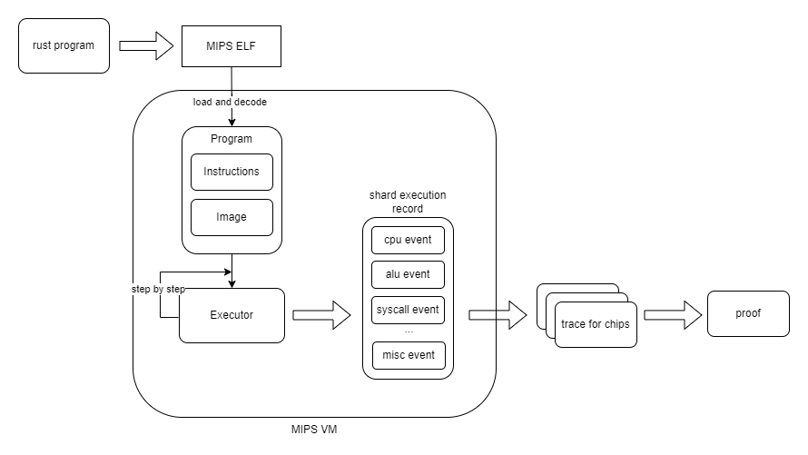

# MIPS VM
Ziren is a verifiable computation infrastructure based on MIPS32, designed to generate zero-knowledge proofs for programs written in Rust (and Go). Ziren adopts the MIPS32r2 instruction set. The MIPS VM, one of the core components of Ziren, is the execution framework for MIPS32r2 instructions. Below we briefly introduce the advantages of MIPS32r2 over RV32IM and the execution flow of the MIPS VM.

## Advantages of MIPS32r2 over RV32IM

**1. MIPS32r2 is more consistent and offers more complex opcodes**
  - The J/JAL instructions support jump ranges of up to 256MiB, offering greater flexibility for large-scale data processing and complex control flow scenarios.
  - MIPS32r2 has rich set of bit manipulation instructions and additional conditional move instructions (such as MOVZ and MOVN) that ensure precise data handling.
  - MIPS32r2 has integer multiply-add/sub instructions, which can improve arithmetic computation efficiency.
  - MIPS32r2 has SEH and SEB sign extension instructions, which make it very convenient to perform sign extension operations on char and short type data.
   
**2. MIPS32r2 has a long-established ecosystem**
  - MIPS32r2 is a fixed, complete specification that has been in wide use for more than 20 years, so there are no optional extensions whose combinations the zkVM must track.
  - MIPS is used by Optimism's fault-proof VM (Cannon).

**3. The branch-delay slot is part of the proved semantics**
  - A MIPS32 branch or jump takes effect after the instruction in its delay slot. Ziren carries the machine state as the pair `(pc, next_pc)`, so a transfer sets the second component and the delay-slot instruction still executes. The instruction set is proved as specified, delay slot included.

## Execution Flow of MIPS VM

The execution flow of MIPS VM is as follows:

Before execution, the developer's Rust or Go program is compiled by the Ziren toolchain for the `mipsel-zkm-zkvm-elf` target into a MIPS32r2 ELF binary.

The MIPS VM executes the ELF as follows:
1. The ELF is loaded into a [Program](https://github.com/ProjectZKM/Ziren/tree/main/crates/core/executor/src/program.rs): all data is loaded into the memory image, and all code is decoded into the [Instruction](https://github.com/ProjectZKM/Ziren/tree/main/crates/core/executor/src/instruction.rs) list. The program image is fixed by the verifying key.
2. The executor runs the instructions from the ELF entry point until the program halts (the `HALT` syscall, or `exit_group` for Linux-ABI programs), updating the registers, `HI`/`LO` and memory at each step. It runs either as an interpreter or with a just-in-time compiler. The run is cut into shards: a shard closes when the committed trace area it would produce reaches a fixed limit, so the number of shards depends on the instruction mix, not only on the cycle count.
3. For each shard, the executor records the [events](https://github.com/ProjectZKM/Ziren/tree/main/crates/core/executor/src/events) the prover needs: executed instructions, memory accesses, syscalls and precompile calls. In a multi-GPU deployment the coordinator runs the program once and records only each shard's starting state and inputs, and each GPU worker re-executes its own shard.

After execution, the prover uses the execution record:
  - Each opcode family has its own chip, and every executed instruction becomes one row of its chip; there is no central CPU table. Memory accesses, byte lookups, syscalls and precompiles have their own chips.
  - The chips' traces are proved per shard, and the shard proofs are composed into one proof (see [Prover Architecture](../design/prover-architecture/prover-architecture.md)).

## Memory Layout for guest program
The memory layout for guest program is controlled by VM, runtime and toolchain.
### Rust guest program
Two kinds of allocators are provided to rust guest program
 - bump allocator: both normal memory and program I/O is allocated from the heap. And the heap address is always increased and cannot be reused.

|   Section	  |    Start	 |     Size	        |   Access		| Controlled-by |	
| ----------- | ---------- | ---------------- | ----------- | ------------- |
| registers 	|    0x00	   | 36	              |     rw      |     VM        |
| Stack	      | 0x7f000000 |(stack grows down)|		  rw      |   runtime     |
| Code			  |            |                  |             |               |
|   .text	    |            |.text size        |     ro      |   toolchain   |
|   .rodata	  |            |.rodata size      |     ro      |   toolchain   |
|   .eh_frame	|            |.eh_frame size    |     ro      |   toolchain   |
|   .bss	    |            |.bss size         |     ro      |   toolchain   |
| Heap (contains program I/O) |	_end | 0x7f000000 - _end | rw | runtime     | 

 - embedded allocator： Program I/O address space is reserved and split from heap address space. A [TLS heap](https://github.com/rust-embedded/embedded-alloc) is used for heap management.

|   Section	  |    Start	 |     Size	        |   Access		| Controlled-by |	
| ----------- | ---------- | ---------------- | ----------- | ------------- |
| registers 	|    0x00	   | 36	              |     rw      |     VM        |
| Stack	      | 0x7f000000 |(stack grows down)|		  rw      |   runtime     |
| Code			  |            |                  |             |               |
|   .text	    |            |.text size        |     ro      |   toolchain   |
|   .rodata	  |            |.rodata size      |     ro      |   toolchain   |
|   .eh_frame	|            |.eh_frame size    |     ro      |   toolchain   |
|   .bss	    |            |.bss size         |     ro      |   toolchain   |
| Program I/O | 0x3f000000 | 0x40000000	      |     rw      |    runtime    |
| Heap        |	_end       | 0x3f000000 - _end | rw         |    runtime    | 

### Go guest program
Go guest program is similar to embedded-mode rust guest program, except that the initial args is set by VM at the top of the stack. The memory layout is as follows:

|   Section	  |    Start	 |     Size	        |   Access		| Controlled-by |	
| ----------- | ---------- | ---------------- | ----------- | ------------- |
| registers 	|    0x00	   | 36	              |     rw      |     VM        |
| Stack	      | 0x7f000000 |(stack grows down)|		  rw      |   runtime     |
|   Initial args | 0x7effc000 |   0x4000      |     ro      |     VM        |
| Code			  |            |                  |             |               |
|   .text	    |            |.text size        |     ro      |   toolchain   |
|   .rodata	  |            |.rodata size      |     ro      |   toolchain   |
|   .eh_frame	|            |.eh_frame size    |     ro      |   toolchain   |
|   .bss	    |            |.bss size         |     ro      |   toolchain   |
| Program I/O | 0x3f000000 | 0x40000000	      |     rw      |    runtime    |
| Heap        |	_end       | 0x3f000000 - _end | rw         |    runtime    |
